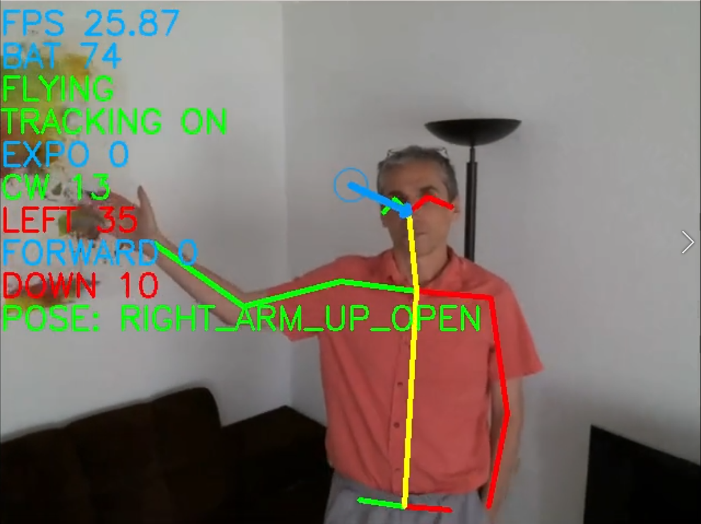

# tello-openpose
Using OpenPose with the Tello Drone to make selfies. This program gets the video stream from the Tello camera, processes it to make the drone follow the person's face and recognize poses to control the drone.  

Video demonstration here : __[Tello drone and computer vision: selfie air stick](https://youtu.be/RHRQoaqQIgo)__

Warning : this is just my exploration of a few computer vision techniques that can be used with a Tello drone. I did it for the fun and didn't try to make a finalized, well packaged product. So sorry for the non-optimized code and the lack of comments :-) 

Tested only on Ubuntu 18.04. **You need a powerful nvidia GPU to run Openpose fast enough.** A GTX 1080Ti was used here. Probably, a less powerful GPU can also work, but you will get a lower "frames/second" and will need to tune the PID controller parameters.

## Libraries and packages

### OpenCV, pynput, pygame : 
Mainly used for the UI (display windows, read keyboard events, play sounds). Any recent version should work.

### Openpose :
I use the official release https://github.com/CMU-Perceptual-Computing-Lab/openpose

Installed (with Python API) as explained here : https://github.com/CMU-Perceptual-Computing-Lab/openpose/blob/master/doc/installation.md#python-api

### TelloPy :
Python package which controls the Tello drone.
https://github.com/hanyazou/TelloPy

### simple-pid :
A simple and easy to use PID controller in Python.
https://github.com/m-lundberg/simple-pid

Used here to control the yaw, pitch, rolling and throttle of the drone. 

The parameters of the PIDs may depend on the processing speed and need tuning to adapt to the FPS you can get. For instance, if the PID that controls the yaw works well at 20 frames/sec, it may yield oscillating yaw at 10 frames/sec.  

## Files of the repository

### OP.py :
My own layer above the official Openpose python wrapper : https://github.com/CMU-Perceptual-Computing-Lab/openpose/blob/master/doc/modules/python_module.md

Modify MODEL_FOLDER to point to the directory where the models are installed.

### CameraMorse.py :

Designed with the Tello drone in mind but could be used with other small cameras.
When the Tello drone is not flying, we can use its camera as a way to pass commands to the calling script.
Covering/uncovering the camera with a finger, is like pressing/releasing a button. 
Covering/uncovering the camera is determined by calculating the level of brightness of the frames received from the camera
Short press = dot
Long press = dash
If we associate series of dots/dashes to commands, we can then ask the script to launch these commands.

Look at the main of the file to have an example.

### SoundPlayer.py :
Defines classes SoundPlayer and Tone used to play sounds and sine wave tones in order to give a audio feedback to the user, for instance, when a pose is recognized or when using CameraMorse. Based on pygame. The sounds are ogg files in 'sounds' directory.

### FPS.py :
Defines class FPS, which calculates and displays the current frames/second.

### tello_openpose.py :
This is the main application. 

Instead of starting from scratch, I used the code from: https://github.com/Ubotica/telloCV/blob/master/telloCV.py A lot of modifications since then, but the hud still looks similar.

Just run with:
python tello_openpose.py

Don't use the "--multiprocess" argument. I had to hack TelloPy to make it work, so it would not work with the official TelloPy. My goal was to have one process reading the video stream from the Tello and one process doing all the remaining stuff, in particular, the intensive Openpose processing. On my configuration, it gives a slightly better FPS (I used it to make the youtube video), but not as good as I expected (and the reason is still not clear to me). It would need more investigation.

-----
A big thanks to all the people who wrote and shared the libraries/programs I have used for this project !

